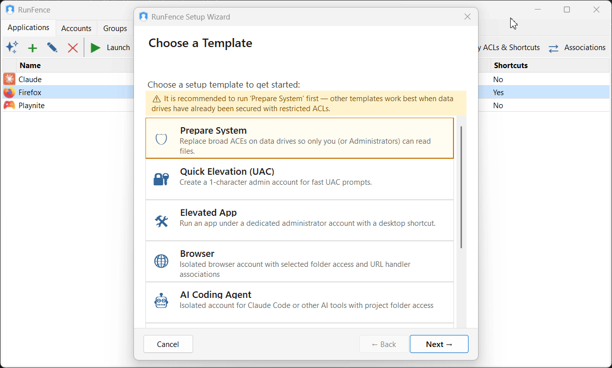
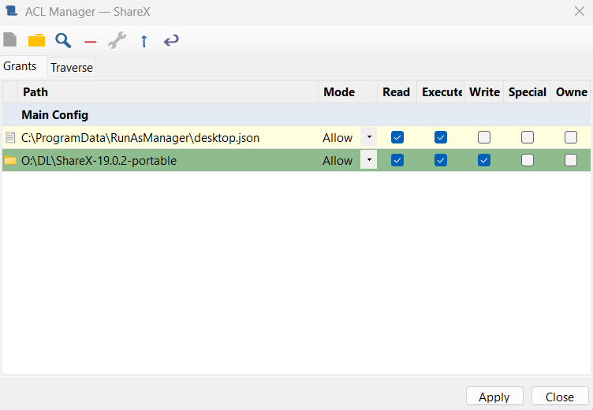
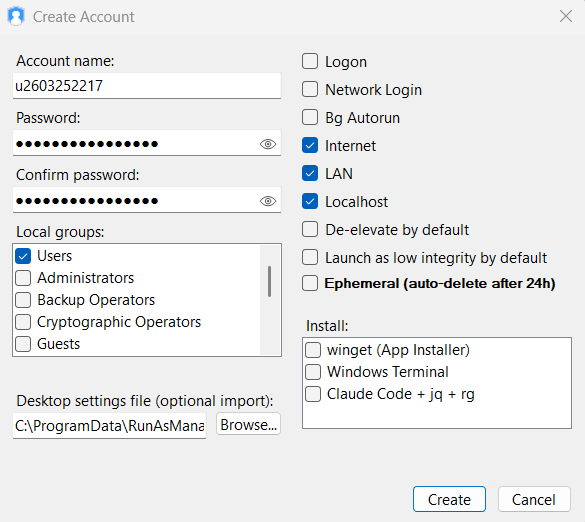

# RunFence

> Run each Windows app under its own dedicated local account — fully isolated from your personal files and other apps — without VMs, without password prompts, and without leaving your desktop.

[](LICENSE.md)
[](https://github.com/runfence/RunFence/releases)

**[⬇ Download the latest release](https://github.com/runfence/RunFence/releases)**



---

Any non-elevated app can quietly access your files, browser data, and saved credentials. A malicious or compromised program could steal crypto wallets, extract passwords, or encrypt your files—without obvious signs.

RunFence isolates apps by running each one under its own local Windows account, launched with a single click.

Normally, using separate accounts is inconvenient—runas prompts for passwords every time, the credential caches are unreliable and exposes credentials to other apps on the same account. RunFence removes this friction by storing credentials securely in an encrypted vault and handling launches seamlessly.

Windows already blocks accounts from accessing each other’s standard folders (Documents, Downloads, Desktop, AppData). For anything outside those, the Account ACL Manager lets you define additional access rules once, enforced by Windows going forward.

RunFence is open source under the Elastic License 2.0, so you can verify exactly what it does.

---

## Use Cases

- **Crypto wallet / trading app** — run under its own account so no other process can touch its data files or private keys
- **Browser profile isolation** — other apps cannot access saved passwords, session cookies, or browsing history
- **AI coding assistant** — run Claude Code (with `--dangerously-skip-permissions`) or similar tools under a dedicated account that only has access to specific project directories; it cannot reach your SSH keys, browser profiles, or wallet files
- **SSH keys and developer secrets** — dedicated dev account that is locked out of your personal files, with access only to the repositories it needs
- **Untrusted or unfamiliar software** — restricted account that cannot reach your documents or credentials
- **Games** — run without trusting the developer with your documents, wallets, or work files; full native performance, unlike a VM; works for games that don't require elevation
- **Elevated app under a dedicated admin account** — launch without typing a password; credentials are stored securely in the vault
- **Ad-hoc run-as for any app** — even apps not pre-configured in RunFence can be launched elevated or under a different account without entering a password; the interactive user confirms the launch at the time it happens

---

## Key Features

### Application Isolation Without Virtualization
Each app runs under a real Windows account. The OS enforces file system boundaries —
no hypervisor, no compatibility issues, no performance overhead.

### AppContainer Sandboxing
For stronger isolation, run apps inside Windows AppContainer profiles instead of plain
account separation. AppContainer goes significantly further: separate IPC namespace,
restricted network access, tightly controlled COM access, and many other OS-level
restrictions that plain account separation does not impose. Most apps are not compatible,
but for those that are it provides a much tighter sandbox — all configured from the
RunFence GUI.

### Low Integrity Mode
Run apps at Windows Low integrity level. Low integrity restricts the app's ability to
interact with other processes, simulate user input, and install keyboard hooks — even
within the same account. A useful extra layer for apps you want to prevent from
interfering with the rest of the session.

### De-Elevation
When launching an app under an admin account, RunFence can strip the elevated
privileges from the process token — the app runs as admin-group member but without
active admin rights. Useful when an app requires an admin account but should not have
full administrative power. Note: Administrators group membership cannot be removed, only
the active elevation.

### Per-App Directory ACLs
Lock or grant access to an app's own directory at the OS level:

- **Deny-mode**: adds deny ACEs for specific accounts — prevents those accounts from
  launching the app, so it can only ever be started from its dedicated isolated account
  and cannot be accidentally run from an unisolated one
- **Allow-mode**: disables permission inheritance on the folder and replaces it with
  fully custom rules — granting access to the app's dedicated account and restricting
  others as needed; gives precise control over who can reach the folder, including
  locations the dedicated account couldn't access by default

### Account ACL Manager
The dedicated tool for data isolation beyond the defaults. Standard Windows user folders
(Documents, Downloads, Desktop, AppData, etc.) are already inaccessible to other
accounts out of the box. For everything else — shared drives, custom data directories,
application data outside the user profile — configure deny or allow rules for any account
or AppContainer on any path. Unlike Windows Explorer, it supports configuring
ACLs using AppContainer SIDs. All rules are tracked: when an account or
container is deleted, its ACL entries are cleaned up automatically.



### Encrypted Credential Vault
Account passwords stored locally using DPAPI + AES-256-GCM with Argon2id key
derivation, protected by a PIN and the admin account (DPAPI is account-bound — the
credentials are inaccessible without both). No credentials ever leave the machine. The vault
locks automatically when the GUI is minimized or after idle timeout.

### Startup Security Scanner
At startup, RunFence scans for two classes of issues:

- **Privilege escalation paths** — locations Windows executes automatically at elevated
  privilege that one of your restricted-account apps can write to; that app could plant
  code that later runs as SYSTEM
- **Access control anti-patterns** — configurations that undermine proper per-folder
  isolation, such as accounts having access to an entire drive root instead of specific
  folders

**14 scan categories:**
- Startup folders (machine-wide and per-user)
- Registry Run keys (HKLM + HKCU + all loaded user profiles, including RunOnce and Wow6432Node variants)
- Services — binary paths, parent folders, unquoted path vulnerabilities
- Scheduled tasks — executable paths for all tasks
- Logon and GP scripts — machine-level and per-user group policy scripts
- System DLL injection points — AppInit_DLLs, print monitors, LSA packages, Winlogon, Image File Execution Options (debugger hijacking)
- Parent folder replaceability — flags cases where delete-file + write-to-parent rights allow silently swapping a binary
- Disk roots (non-system drives) — flags accounts with access to an entire drive root; drive-root access conflicts with proper per-folder access control and undermines isolation

For each auto-execute location, it checks whether any non-admin account has write,
append, change-permissions, or take-ownership rights on the file or its containing
directory.

Isolation is only as strong as the boundary — whether that's a restricted account that
can write to a path that later runs as SYSTEM, or one with access broader than it needs.

### Shortcuts & Tray Launching
Create shortcuts anywhere — desktop, Start Menu, or any folder — that launch apps
through an IPC pipe with one click, no interaction with the main window needed.

### App Discovery
When enabled for an account, apps installed into its local AppData that create Start
Menu shortcuts are detected automatically and appear in the tray quick-launch menu.

### Folder Browser & Terminal Quick Access
Explorer cannot run under a different account in the same session. RunFence
provides two one-click toolbar buttons for working within a different account without
switching sessions: a folder browser based on the Windows file open dialog (full Explorer
navigation, otherwise inaccessible) and a terminal — both running under the specified
account.

### Default Browser & File/URL Associations
Set any RunFence-managed app as the default handler for links and file types. When you click
a URL, open a document, or follow a `mailto:` link, Windows routes it directly to the
configured app running under its isolated account — with no extra steps.

- Assign any file extension or URL scheme to any app: PDFs to your sandboxed PDF reader, links
  to your isolated browser, email links to your isolated mail client
- Manage all assignments from a single **Associations** window; reassign any type at any time
- "Set as Default Browser" shortcut registers all browser associations in one click
- RunFence appears as a single **"RunFence"** entry in Windows Settings > Default Apps

### Cross-User Drag and Drop
A lightweight bridge process enables dragging files between windows running under
different accounts — something Windows doesn't support natively. For example, drag a
file from your main desktop into a browser running isolated under a dedicated account.

Press the copy hotkey (Ctrl+Alt+C by default) to open a drop target window, drag your
files or folders onto it, then press the paste hotkey (Ctrl+Alt+V) on the target window
 under the other account.

### Ephemeral Accounts
Create a disposable Windows account for a one-time run. RunFence automatically
removes the account and cleans up its profile after 24 hours.

### Desktop Settings Transfer
Export desktop and Explorer settings from one Windows account and import them into
another — mouse speed and button layout, keyboard repeat rate and delay, desktop
background and color theme, Explorer view and folder settings, and other per-user
preferences. Useful when setting up a new isolated account so it feels like your main
desktop from day one.

### Account Management
Create and delete Windows accounts directly from the GUI, rotate passwords with one
click, transfer desktop settings between accounts, and clean up orphaned profiles left
behind by deleted accounts. One-click shortcuts to install Windows Terminal and Claude
Code into a specified account.

Account restrictions configurable per account:
- **Logon** — when disabled, hides the account from the Windows login screen and blocks
  interactive logon; the account remains usable only through RunFence
- **Network Login** — when disabled, restricts to local access; blocks RDP and SMB
  access from outside the machine (uses LSA policy)
- **Background Autorun** — when disabled, blocks the account from running background
  processes via Task Scheduler and services



**SID migration** — when an account is deleted and recreated (Windows assigns a new SID),
scan filesystem ACLs and config data to remap all references from the old SID to the new
one, keeping your isolation setup intact.

### Per-Account Firewall
Control outbound network access per account with Windows Firewall rules scoped by
SID:

- **Allow Internet** — block all outbound internet traffic (allowed by default)
- **Allow Localhost** — block loopback communication (allowed by default)
- **Allow LAN** — block local network traffic to private ranges (allowed by default)

Each setting is independent. A per-account IP/domain allowlist lets specific
destinations bypass the internet block. DNS servers are auto-included when the
allowlist is non-empty so domain resolution keeps working. Rules are re-enforced
on startup and cleaned up on account deletion or SID migration.

### On-Demand Config Files
App entries and ACL rules can be split across multiple encrypted config files. Load
additional configs on demand — from removable media or any path — so that certain
app entries or ACL configurations stay hidden from the tray and UI until explicitly
loaded. Useful when you need a clean separation between what is always visible and
what should only appear in specific contexts.

### Auto-Lock & Idle Timeout
The management GUI auto-locks when minimized or after idle timeout, keeping your
credential vault protected when you step away.

---

## Why Native Windows Accounts Beat Driver-Based Sandboxes

| | RunFence | Sandboxie / driver-based |
|---|---|---|
| Kernel driver required | No | Yes |
| Interception layer | None | Yes — bypass vectors exist |
| Enforcement mechanism | Windows kernel itself | Third-party driver |

- **Native Windows boundaries** — isolation is enforced by the OS account model, not by a third-party mechanism inventing its own separation layer on top of Windows
- **No VFS quirks** — driver-based sandboxes need a filesystem virtualization layer to work, which brings compatibility issues and bypass vectors; account separation doesn't require one
- **Enforced by the Windows kernel** — the same mechanism the OS uses to enforce account separation at all levels
- **Cannot be bypassed at the userspace level** — isolation is at the OS account boundary, not at an API interception layer
---

## Evaluation Mode

**Free, no time limit.**

Evaluation mode includes periodic nag reminders. If you find RunFence valuable, consider purchasing a license to support continued development — your contribution directly funds improvements and new features.

Purchasing a license unlocks:

- **Unlimited app entries** *(evaluation: up to 3)*
- **Unlimited stored credentials** *(evaluation: up to 3)*
- **AppContainer sandboxing** *(evaluation: up to 1)*
- **Account hiding** *(evaluation: up to 1 hidden account)*
- **Auto-lock & idle timeout**
- **Unlimited Internet whitelist entries** *(evaluation: up to 1)*
- **Handler associations** *(evaluation: browser only — http, https, .htm, .html)*

You can create as many accounts as you like — the limit applies only to hiding them from
the Windows login screen.

---

## Pricing

Free evaluation license is available without time limit.

Paid licenses are **per machine** — each installation requires its own key, tied to the machine it was activated on.

See [PAYMENT.md](PAYMENT.md) for pricing tiers, supporter donations, and payment instructions.

---

## FAQ

**The source is published — does that mean I can do anything with it?**

No. RunFence is **source-available**, not open source in the OSI sense. The source is published for transparency, auditing, and contributions — not to grant the unrestricted freedoms.

**What you can legally do:**
- Use it free of charge — no time limit, evaluation feature limits apply
- Build it from source and audit it to verify the binary matches what is published
- Fork it to modify and contribute — pull requests welcome; contributions require signing a CLA

**What is not permitted:**
- **Cracking or bypassing the license key.** Patching the binary or modifying the source to remove or bypass evaluation limits is prohibited.
- **Selling your own licenses.** Replacing the public key to issue your own license keys is explicitly prohibited. You cannot fork this and monetize it yourself.
- **Stripping attribution.** Removing copyright notices or the license is not allowed.

**Does RunFence send any data to the Internet or phone home?**

No. RunFence is entirely offline — no telemetry, no license checks against a server, no update pings. Licensing is validated locally.

**Are my stored credentials safe from other apps on my PC?**

Yes. Passwords are encrypted with DPAPI using a PIN-derived entropy value (32 bytes, derived via Argon2id + HKDF from your PIN). DPAPI decryption requires both the correct Windows account session *and* the correct entropy — an app on the same Windows account that tries to call DPAPI without that entropy gets a decryption failure. Without your PIN, the credentials cannot be decrypted. Apps running under *other* accounts — which is the point of RunFence — cannot reach DPAPI-protected data at all. 

**Can an isolated app read my personal files?**

Standard Windows user folders — Documents, Downloads, Desktop, AppData, and similar — are inaccessible to other accounts by default. For paths outside those defaults (shared drives, custom directories), use the Account ACL Manager to add explicit deny rules.

**What happens if I forget my PIN?**

Both stored passwords and app configuration are unrecoverable without the PIN. You can start fresh, but all encrypted data is gone. Keep your PIN somewhere safe. 

But the isolated accounts you created are still there, you can reset their password and use them again.

**What are the risks of using a simple PIN?**

It depends on how an attacker could access your data, and whether RunFence runs under a dedicated admin account.

**If someone gets the files offline** (steals the machine or copies the files):

- The *app configuration* is protected only by the PIN which an offline attacker can bruteforce.
- *Stored passwords* - he cannot access them without cracking both your PIN and Windows account password, which is the stronger barrier here.

**If a compromised app runs under the same account as RunFence**: it can read the vault files directly. A weak PIN is a real risk.

**If RunFence runs under a dedicated admin account** (the intended setup): other apps cannot read the vault files, PIN strength doesn't matter.

**Does this work with games?**

It depends on the launcher and anti-cheat system.

**Installation**: most launchers (Epic, GOG, EA App, and others) require elevation to run the game's install scripts, which are provided by the game publisher. The game itself then runs under the isolated account — so isolation applies to the running game, not the install. You are trusting the launcher company to verify those elevated scripts. **Steam is the only major launcher that can itself be installed without elevation.** For individual games within Steam, when elevation is requested you can decline — some games work without it, others do not.

**Should I make an isolated account admin to make games work?**

No — and this applies to any isolated account. Whether UAC is a real security boundary depends on the account type:

- **Non-admin isolated account**: UAC requires entering credentials for a separate admin account that the isolated app does not know — UAC is a genuine barrier.
- **Admin isolated account**: any code running under it can bypass UAC silently using well-known techniques, without any user confirmation.

If you give an isolated account admin rights, any app running under it can silently acquire full admin privileges. The isolation is broken. Keep isolated accounts as standard (non-admin) users — or remove them from the Users group entirely for tighter restriction.

If you need to temporarily lift isolation, use UAC prompt to enter a separated admin account credentials. 

**How do I share files between my main account and an isolated one?**

Place files in a dedicated shared folder and use the Account ACL Manager to grant the isolated account access. For ad-hoc transfers, the built-in cross-user drag-and-drop bridge lets you drag files between windows of different accounts on the desktop.

**Why is there Folder Browser button?**

Explorer cannot run as a different Windows account in the same session. The Folder Browser button opens a file dialog under the specified account for full folder navigation. In options you can replace folder browser with your favorite file manager e.g. Total Commander.

Note: if you open Explorer window (not file dialog) from inside an isolated account, e.g. from your download manager, the window will be opened under your interactive user account - not the isolated account. Everything you launch from Explorer window will be launched under your interactive account.

**Can an isolated app capture keyboard input from my desktop?**

Not if Low Integrity Mode is enabled or an App Container is used.

**Can isolated apps access my clipboard?**

Not if it's an App Container app and it's not in foreground.

**What is AppContainer and when should I use it?**

AppContainer is a stronger sandbox but most apps will not run correctly in there.

**What about Microsoft Store (UWP/MSIX) apps?**

Store and UWP apps are tied to the interactive user session and generally cannot be launched under a different Windows account. RunFence's AppContainer sandboxing is a separate mechanism for ordinary Win32 apps and is unrelated to the Store packaging model.

**My AppContainer app can't access a folder even though the account has permission. Why?**

Windows checks both the account and the container identity on every file access.

The standard Windows permission editor has no way to specify an AppContainer SID. Use the Account ACL Manager instead. When you grant access to an AppContainer SID, RunFence automatically mirrors the same permission to the interactive user — without that, the app would still be blocked regardless of the container grant.

**Can I move my RunFence configuration to a different machine?**

The main config (`%APPDATA%\RunFence\config.dat`) and extra configs are portable but you will have to use the SID Migration button for accounts. 

Your stored account passwords are NOT portable (even for a different account on the same machine).

---

## Requirements & Installation

- Windows 10 or later (x64)
- .NET 10 Desktop Runtime
- Administrator privileges (the management GUI runs elevated)

**[⬇ Download the latest release from GitHub Releases](https://github.com/runfence/RunFence/releases)**

---

## Contributing

Issues and pull requests are welcome for bug reports and feature suggestions.
Contributors must sign a CLA (Contributor License Agreement) for their code to be
included in the project.

---

## Building from Source

The full source code is available for review and auditing. You can build and run your
own binary to verify that what you're running matches what is published.

```bash
dotnet build RunFence.sln -v quiet
dotnet test src\RunFence.Tests\RunFence.Tests.csproj --no-build
```

Requires: .NET 10 SDK, Windows.

---

## Third-Party Notices

See [THIRD-PARTY-NOTICES.txt](THIRD-PARTY-NOTICES.txt).

---
## Development Tools

```
dotnet tool install --global wix
wix extension add --global WixToolset.UI.wixext/6.0.0
wix extension add --global WixToolset.BootstrapperApplications.wixext/6.0.0
wix extension add --global WixToolset.Netfx.wixext/6.0.0
```

---

## Contact / Security

**Email:** [runfencedev@gmail.com](mailto:runfencedev@gmail.com)

**GitHub:** https://github.com/runfence/RunFence

To report a security vulnerability, please email directly rather than opening a public
issue.
